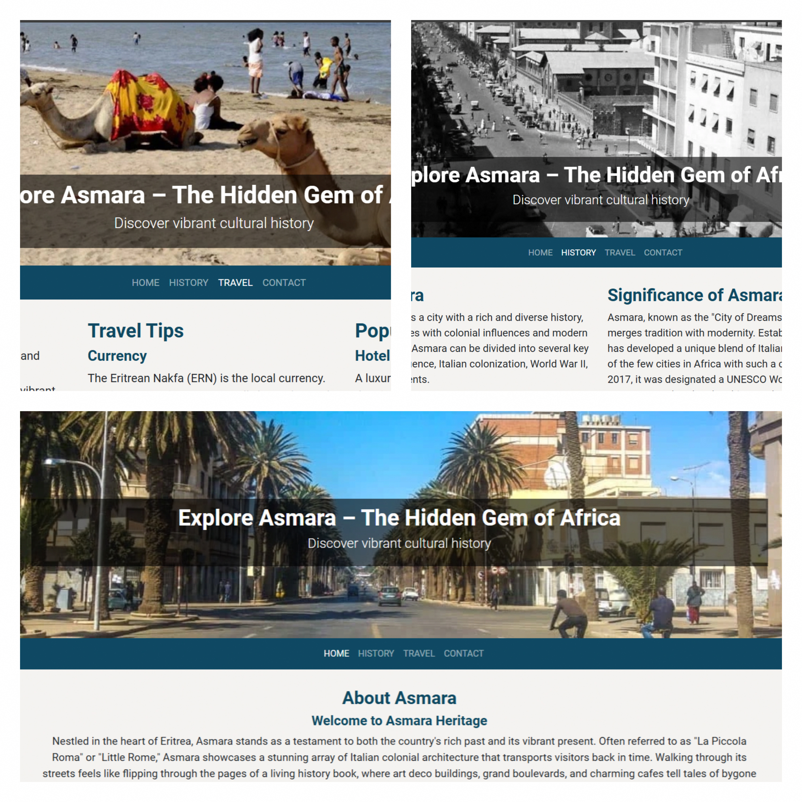

# **Asmara's History Website**

## Project Overview
Asmara’s History Website is a dedicated platform aimed at presenting the rich history, culture, and unique architecture of Asmara, the capital city of Eritrea. This website seeks to increase global awareness of Asmara, attract tourists, and foster a sense of connection for the Eritrean diaspora. By providing valuable insights, practical travel information, and engaging content, the site highlights Asmara's significance as a historical and cultural gem.

## **Contents**
- [User Experience (UX)](#user-experience-ux)
  - [Initial Discussion](#initial-discussion)
  - [User Stories](#user-stories)
- [Design](#design)
  - [Colour Scheme](#colour-scheme)
  - [Typography](#typography)
  - [Imagery](#imagery)
  - [Wireframes](#wireframes)
  - [Features](#features)
  - [Accessibility](#accessibility)
- [Technologies Used](#technologies-used)
  - [Languages Used](#languages-used)
  - [Frameworks, Libraries & Programs Used](#frameworks-libraries--programs-used)
- [Deployment & Local Development](#deployment--local-development)
  - [Deployment](#deployment)
  - [Local Development](#local-development)
    - [How to Fork](#how-to-fork)
    - [How to Clone](#how-to-clone)
- [Testing](#testing)
  - [W3C Validator](#w3c-validator)
  - [Solved Bugs](#solved-bugs)
  - [Known Bugs](#known-bugs)
  - [Testing User Stories](#testing-user-stories)
  - [Asmara’s History Website](#asmaras-history-website)
    - [Index Page](#index-page)
    - [History Page](#history-page)
    - [Travel Page](#travel-page)
    - [Contact Page](#contact-page)
  - [Full Testing](#full-testing)
- [Credits](#credits)
  - [Code Used](#code-used)
  - [Content](#content)
  - [Media](#media)
  - [Acknowledgments](#acknowledgments)

---

## **User Experience (UX)**

### **Initial Discussion**
Asmara's History Website is designed to:
- Promote Asmara as a global tourist destination.
- Highlight its historical and cultural heritage.
- Provide an easy way for users to explore the city and plan their visit.

### **User Stories**
1. **Tourists**
   - _As a tourist_, I want detailed information about Asmara's history and tourist attractions.
   - _As a tourist_, I want to easily navigate the site and access travel resources.
2. **Historians & Enthusiasts**
   - _As a history enthusiast_, I want accurate and well-organized historical information.
3. **Local Businesses**
   - _As a local business owner_, I want the website to promote tourism and drive customers to my services.

---

## **Design**

### **Colour Scheme**
- **Primary Color**: Deep blue (#e4962) for professionalism and trust.
- **Secondary Color**: Reddish Orange (#e74C3C) to represent cultural richness.
- **Highlight Color**: Neutral highlight (#f4f3f1) and white for a clean, modern aesthetic.

### **Typography**
- **Headings**: Roboto (sans-serif), bold and modern.
- **Body Text**: Roboto (sans-serif), clear and legible for long paragraphs.

### **Imagery**
- High-resolution images of Asmara's iconic landmarks, cultural artifacts, and historical sites.

### **Wireframes**
Wireframes were created for desktop, tablet, and mobile views to ensure responsive and intuitive design.
For desktop and tablets:
- [Home Page Wireframe](../docs/wireframes/desktop-tablet-home.png) 
- [History Page Wireframe](../docs/wireframes/desktop-tablet-history.png)
- [Travel Page Wireframe](../docs/wireframes/desktop-travel.png)
- [Contact Page Wireframe](../docs/wireframes/desktop-tablet-contact.png)
  
For mobiles:

- [Home Page Wireframe](../docs/wireframes/mobile-home.png) 
- [History Page Wireframe](../docs/wireframes/mobile-history.png)
- [Travel Page Wireframe](../docs/wireframes/mobile-travel.png)
- [Contact Page Wireframe](../docs/wireframes/mobile-contact.png)
  
### **Features**
#### **Index Page (Home)**
- Welcoming banner with a short introduction to Asmara.
- Highlights of featured attractions.
- [Home Page]()

#### **History Page**
- Timeline of Asmara’s historical events.
- Sections showcasing notable figures and cultural artifacts.

#### **Travel Page**
- Travel tips, accommodations, and transportation guides.

#### **Contact Page**
- Contact form with fields for name, email, and message.
- Embedded Google Map for navigation.
- Links to social media and email.

### **Accessibility**
- Semantic HTML for screen readers.
- Alt attributes for all images.
- High contrast between text and background colors.

---

## **Technologies Used**

### **Languages Used**
- HTML5
- CSS3
- JavaScript

### **Frameworks, Libraries & Programs Used**
- Bootstrap for responsive design.
- Font Awesome for social link icons.
- Google Fonts for typography.
- Google Maps for embedding maps.
- GitHub for version control.
- Balsamiq for wireframe design.

---

## **Deployment & Local Development**

### **Deployment**
The site is deployed using GitHub Pages. Visit the live site [here](https://github.com/yohannes2025/project1).

### **Local Development**

#### **How to Fork**
1. Navigate to the GitHub repository.
2. Click the “Fork” button in the top-right corner.

#### **How to Clone**
1. Copy the repository URL from the “Code” dropdown.
2. Open your terminal and run:   [git clone ](https://github.com/yohannes2025/project1)

## Testing

### W3C Validator
- HTML and CSS files passed validation with no major errors.

### Solved Bugs
- Resolved a navbar collapse issue on mobile devices.
- Fixed overlapping text on smaller screen sizes.

### Known Bugs
- Some older browsers might not render certain fonts correctly.

### Testing User Stories
All user stories were tested and verified for functionality and usability.

**Asmara’s History Website**
- **Index Page**
  - Lighthouse: Performance (88%), Accessibility (88%), Best Practices (100%), SEO (100%).
- **History Page**
  - Lighthouse: Performance (72%), Accessibility (89%), Best Practices (100%), SEO (100%).
- **Travel Page**
  - Lighthouse: Performance (76%), Accessibility (88%), Best Practices (100%), SEO (100%).
- **Contact Page**
  - Lighthouse: Performance (96%), Accessibility (85%), Best Practices (100%), SEO (100%).

### Full Testing
The site was tested across various devices and browsers to ensure compatibility and responsiveness.

## Credits

### Code Used
- **Responsive navigation bar** from [Bootstrap documentation](https://getbootstrap.com/).
- **Form validation script** from [Stack Overflow](https://stackoverflow.com/).

### Content
- Historical details sourced from online encyclopedias and books about Asmara.

### Media
- Images from [Unsplash](https://unsplash.com/s/photos/Asmara), [Wikipedia](https://en.wikipedia.org/wiki/Asmara).

### Acknowledgments
- Special thanks to the Code Institute for their guidance and follow-up.
   
